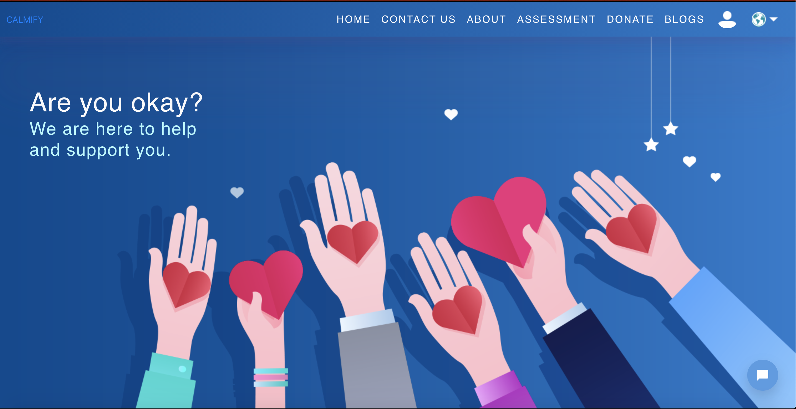

# Suicide Detection & Prevention
This site is built using React to provide a quick and simple platform for suicide prevention and mental health promotion.

# Preview:

# Description:
<ul>
    <li>Database for user's info by Google Firebase.</li>
    <li>Blogs by WordPress API.</li>
</ul>

# Outline & Objective

The purpose of this site is to help users detect suicidal tendency and provide them with: 
&emsp;&emsp; <b>1.</b> 24 hours immediate support. 
&emsp;&emsp; <b>2.</b> Educational support. 

# The Target Audience

The audience is the general public, but in particular, targeting: 
&emsp;&emsp; <b>●</b> People who have suicidal tendency 
&emsp;&emsp; <b>●</b> People who have mental health issues 

## Used Technologies

ReactJS, WordPress API, Firebase Auth
